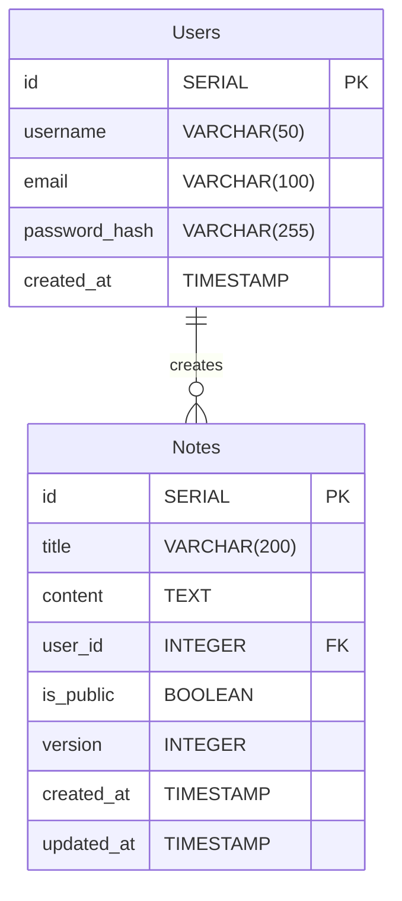

# Note - Advanced Note Taking Application

## Core Features
1. User Management
   - Registration and login with JWT authentication
   - Password hashing and security
   - User profiles with customizable settings
   - Role-based access control (Admin, User)

2. Note Management
   - CRUD operations for notes
   - Rich text editing with markdown support
   - Categories and tags for organization
   - Note sharing and collaboration
   - Version history tracking

3. Organization
   - Notebooks/Folders for grouping notes
   - Hierarchical organization structure
   - Drag-and-drop organization
   - Search functionality with filters

## Technical Stack
1. Backend (Express.js)
   - Express.js for routing and middleware
   - Prisma ORM for database operations
   - PostgreSQL as the database
   - JWT for authentication
   - bcrypt for password hashing
   - class-validator for input validation

2. Additional Features
   - File uploads (images, attachments)
   - Real-time collaboration using Socket.IO
   - Rate limiting for API protection
   - Request logging and monitoring
   - Automated testing setup

## Database Schema


## API Endpoints
```
Authentication:
POST /api/auth/login
PUT /api/auth/password
POST /api/auth/refresh

Users:
POST /api/users

Notes:
GET /api/notes
POST /api/notes
GET /api/notes/:id
DELETE /api/notes/:id
<!-- GET /api/notes/:id/history -->
<!-- POST /api/notes/:id/share -->
<!-- GET /api/notes/shared-with-me -->

Tags:
GET /api/tags
POST /api/tags
DELETE /api/tags/:id
```

### Ref
- Set up express js: https://blog.logrocket.com/how-to-set-up-node-typescript-express/